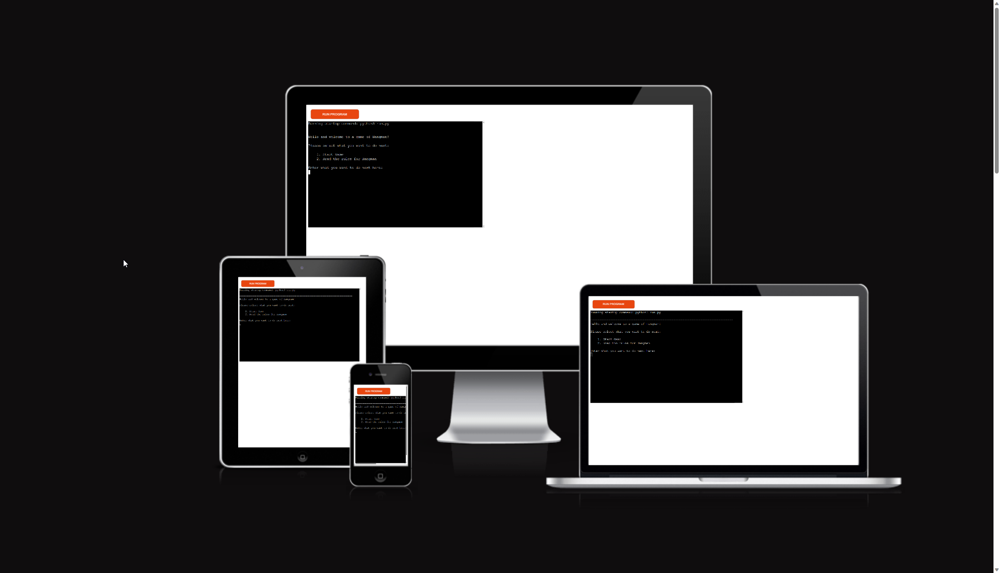

# Hangman Word Game

Hangman Word Game is a python terminal game that is being hosted in a mock terminal on [Heroku](https://www.heroku.com/?)

Users are given the option to either look at the rules or start the game upon first glance. Once the user has entered a username the Hangman game will start. Hangman is a word guessing game where the users play against a computer, where their objective is to figure out the randomly picked hidden word based only on how long the word is, and by guessing letters to find out if they exist in the word or not. However, the user only has 8 guesses to do so as a Hangman will slowly be drawn out for every failed guess until it is fully drawn, and the player has lost. The player can win by being able to fully guess every letter of the hidden words before they run out of guesses. Instructions for how the game works are provided in the main menu screen.

[Live link to Hangman Word Game](https://p3-hangman-word-game.herokuapp.com/) (Right click to open in a new tab)

---

## CONTENTS
* [Flowchart](#flowchart)
* [Features](#features)
  * [Existing Features](#existing-features)
  * [Future Features](#future-features)

* [Technologies Used](#technologies-used)
  * [Languages Used](#languages-used)
  * [Frameworks, Libraries & Programs Used](#frameworks-libraries--programs-used)

* [Deployment](#deployment)

* [Testing](#testing)
    * [Validator Testing](#validator-testing)
    * [Solved Bugs](#solved-bugs)
    * [Unfixed Bugs](#unfixed-bugs)

* [Credits](#credits)

## Flowchart

- I made this flowchart when I was first trying to figure out how to go about making the hangman part of the program to get a better idea on how to approach it.

## Features

### Existing Features

Below are the main features that users will come across when they use the program and play the game. The terminal clears it self after every segment to make it clean and avoid having confusing/confliciting information on the screen.

- The main menu is displayed with a message asking for the users input. Depending on the input, either the game will start by asking for the users username, or they'll be shown the rules/instructions.

2. If the users input is 2 then they will be taken onto the rules page where they will be getting instructed onto how the game works

3. 

4. 

5. 

### Future Features

- Would like to add a hint for every word as it can be extremely difficult to guess words at time without any kind of clue

- A scoring system.

- Add colors and more ASCII to make it look more interesting than just a normal terminal.

## Technologies Used

### Languages Used

Python was the only language used in making this program.

### Frameworks, Libraries & Programs Used

- Git - For version control.

- GitHub - To save and store the files.

- Visual Studio on Gitpod/CodeAnywhere

- [Lucidchart](https://www.lucidchart.com/pages/) was used to sketch out the flowchart when I was first figuring trying to plan out how to make the game.

- [random](https://docs.python.org/3/library/random.html) library to get a random word from a list.

- [os](https://docs.python.org/3/library/os.html) library was used for the clearterminal function to make the terminal appear "cleaner".

- [Am I Responsive](https://ui.dev/amiresponsive) - To show the program hosted on on a wide range of devices.

## Deployment

Github Pages was used to deploy the website. The instructions to do this can be found below:

1. Log in or sign up to Github.
2. Find the repository for this project, [p2-gaming-quiz](https://github.com/Hakesh/p2-gaming-quiz).
3. Click on the "Settings" button in the menu bar for the repository.
4. Click on Pages in the left hand side navigation bar.
5. From the Source dropdown menu, select "Deploy from a branch".
6. From the Branch dropdown menus, select "main" and "/root" respectively.
7. Click Save. Your live Github Pages site is now deployed at the URL shown at the top of the page. **Keep in mind it might take a bit before the page is deployed and a URL is shown, you might have to refresh the page after a few minutes to get it to show.**

The live link can be found here - https://hakesh.github.io/p2-gaming-quiz/

## Testing

I manually tested this project by doing the following:

* Using the [CI PYthon Linter / PEP8 Validator](https://pep8ci.herokuapp.com/#) to validate and confirm that there are no problems
* Testing the input methods by giving invalid inputs, numbers where strings are expected and vice versa.
* Tested on my local terminal and when uploaded to the Heroku mock terminal

### Validator Testing

* PEP8
    * No errors were returned when passing it through the [Code Insitute Python Linter](https://pep8ci.herokuapp.com/#)
    

    
### Solved Bugs

- Unless you knew (or was lucky/smart to type the first letter for the word capitalized) that all the words inside of words_list are capitalized there was no way to win the game as it didn't take that into account. This was fixed by making both all the random words picked from the list uppercase, as well as the input when the user was typing in their guess.

- For every time that you would guess, the hidden word would duplicate it self. This was due to the fact that the variable that stores the hidden word was outside of the while loop which repeats itself after you guess. This was solved by moving the hidden_word variable to inside of the while loop.

### Unfixed Bugs

- Not really a bug as its more that I never implemented it, but if you decice to continue playing after winning or losing the hangman ascii art wont show until after you've done your first guess.

## Credits

- [How to build HANGMAN with Python in 10 MINUTES by Kite](https://www.youtube.com/watch?v=m4nEnsavl6w)
  - This video was useful as it gave me an idea on how to go about making the Hangman game part

- [Clear Terminal code by Poke](https://stackoverflow.com/questions/2084508/clear-terminal-in-python)
  - Wasn't sure how to clear the terminal mid-program but Poke had an excellent reply to the original question. I turned his code
  into a function to make it easy to call upon for when i wanted to tidy up the terminal after certain segments in the game.

- [Hangman ASCII Art](https://codereview.stackexchange.com/questions/101968/hangman-with-ascii)
  - I found these ASCII drawings in another persons python hangman game and thought they looked neat.
